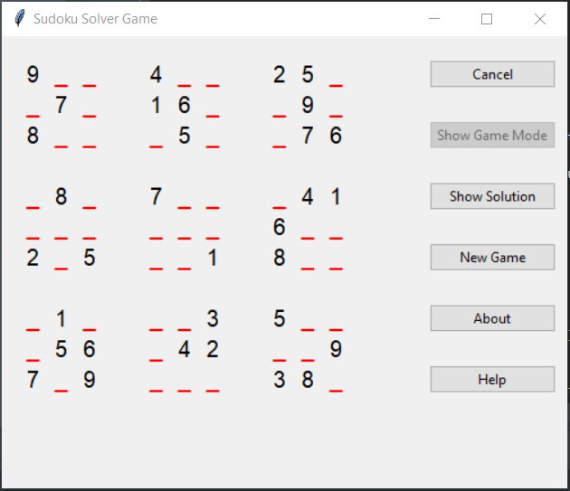
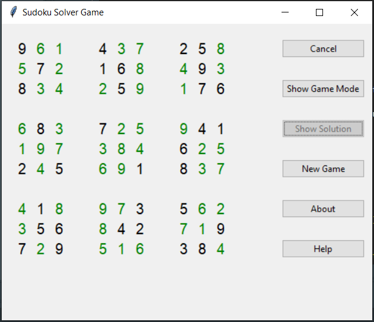

# About:
Welcome to SudokuSolver!
SudokuSolver is a program that offers a random sudoku game to the user from a database of a thousand stored games. The games are stored in a simple format and can be added to in the game file. The program solves the game itself using it's internal solver logic and displays the result on request.

* Developed by Olivia Bhowmik
* Email: developer.olivia.bhowmik@gmail.com
* Game File: sudokuStoredGames.csv
* License: MIT
* Version: 1.0.0
* Technology: Tkinter GUI and Python 3
* Source of games: https://www.kaggle.com/datasets/bryanpark/sudoku (There are a million games here, a random set of 1000 games have been chosen for the project)

# Images:
## Game Mode

## Solution Mode

# Files:
| File Name | Description |
| --------- | ----------- |
| SudokuMainGame.py | Main file that runs the game |
| SolvingSudokuImport.py | Contains the internal solver that passes the solution to the main file |
| SudokuSubsetMaker.py | Makes the 1000 game subset of the 1000000 original games |
| sudokuStoredGames.csv | Contains the subset of games the main file reads from |

# Game Mechanics (Main Game):
* The program accesses a file called “sudokuStoredGames.csv” which contains the thousand games that the user can play (a random game is chosen).
* There are two possible modes in the game, Game Mode and Solution Mode
  * Game Mode takes the game data and passes it through the displaySudokuTable() function that displays the data in sudoku grid format
  * In Solution Mode the program plugs the unsolved game data into its internal sudoku logic solver to derive the solution. The solution is passed to the function displaySudokuTableSolved() that displays the final game.

# Solver Mechanics (Nutshell):
* The solver goes through each cell with a zero value and assigns it two lists. A possible values list (0-9 to begin with) and an impossible values list containing the the rows/columns/box values surrounding the cell.
* The solver then finds the difference between the two lists and shortens the possible values list.
* If a zero cell gets down to a single possible value, then the solver replaces the zero placeholder with that single possible value
* The determination process is then repeated which is expected to yield additional cells with a single possible value remaining, taking the sudoku closer and closer to getting solved.

# Solver Mechanics (Detailed):
1. The first step of the Solver is sending the input game into a function called grid(). The grid() function loops through the game string, turns each value into an integer and creates a list of lists that contains each row of the sudoku.
2. After that a function called box_spec() creates a list of lists assigning each big box in the sudoku it’s own general name (AX to CZ) and which rows and columns are included in each corresponding box
3. A function called cell_spec() is called that returns the coordinate of all the cells of the sudoku grid in a list of lists format
4. Then the function addValsToFinalBox() is called that takes in the the data processed in steps 1 and 3. The function uses the row and column coordinates to loop through the values list and determines the current value for each cell. The list of lists that the function returns contain the row, column and value in that order.
5. The next function is addBoxesToFinalBox() to which the output of steps 2 and 4 are passed. The function loops through the boxes and the cell grid, checking whether the row and column for each cell falls into the range of the box. If it does, the function inputs the name of the box (AX to CZ) into the cell grid.
6. After this the addPosValsToFinalBox() function further modifies the step 5 output. If the cell grid has a value of zero(to be solved position) then it appends a list of all the possible values (0-9). Whereas if there is a value already, the function just appends an empty list to retain the table structure. There’s an additional empty list appended for holding impossible values for every position.
7. Then the program enters a while loop that continuously calls on multiple functions:
  * The SurroundingValCheck() function checks each cell and if the cell value is equal to zero then the function calls RowValFinder(), ColValFinder() and BoxValFinder() to find all the existing value in the cell's row, column and big box. Finally, the function takes all the previously gathered information and compiles it into a list that replaces the empty impossible values list from step 6.
    * RowValFinder(), ColValFinder() and BoxValFinder() work by looping through the cell grid and checking whether the row/column/boxSpecs that have been passed to it match up with a value. If a value is in the row/column/box and it’s not equal to zero then the functions append it to the empty list that they return.
  * The next function called is DelImpossRowVals() which goes through the cell grid and calls LatestPossValDet() to take out the values that exist in the impossible values list to determine a shorter list of possible values.
  * Then the while loop uses ExitChecker() to test whether the loop should end. The exit checker assumes false at the start and if the while loop has made 10 or more passes then the checker always returns false because at that point the Sudoku is either done or impossible to solve. The checker keeps returning true for carryon if atleast one cell position has only one possible value left after deleting the impossible values.
  * The final function that’s called in the while loop is ValReplacer() which goes through the cell grid, and for every value equalling zero it checks whether there’s only one possible value left. If there is, it replaces the zero placeholder with the actual value and empties both the possible and impossible values lists.
8. The final step the solver does after exiting the while loop is to call FinalValsList() which takes every actual value in the cell grid and compiles it into a string and returns the string to the main game.

# Assumptions and Known Limitations:
* The solver is good at determining possible values for a cell position and if the game is deterministic, then it's always excpected that some of the cells always boil down to a single value. However, if the game is very hard(probabalistic) then there might not be a single value determined for any of the cells. This scenario will be covered in a future release of the solver.

# Future Plans:
Below are some of the ideas I want to implement in the future:
* Enhance the GUI so that users can input values in Game Mode
* Hint systems
* Valid game generator
* Timer + Scores

# Installing the Game:
* First make sure to have Python Version 3 installed on your device from https://www.python.org/
* Download the game files from gitHub
* Open the game main file "SudokuMainGame.py" through a Python editor and run

# Playing the Game:
* Fill in the missing numbers in the red underlines
* To show the right answers click the 'Show Solution' button
* To go back to game mode click 'Show Game Mode'
* To exit the program click 'Cancel'
